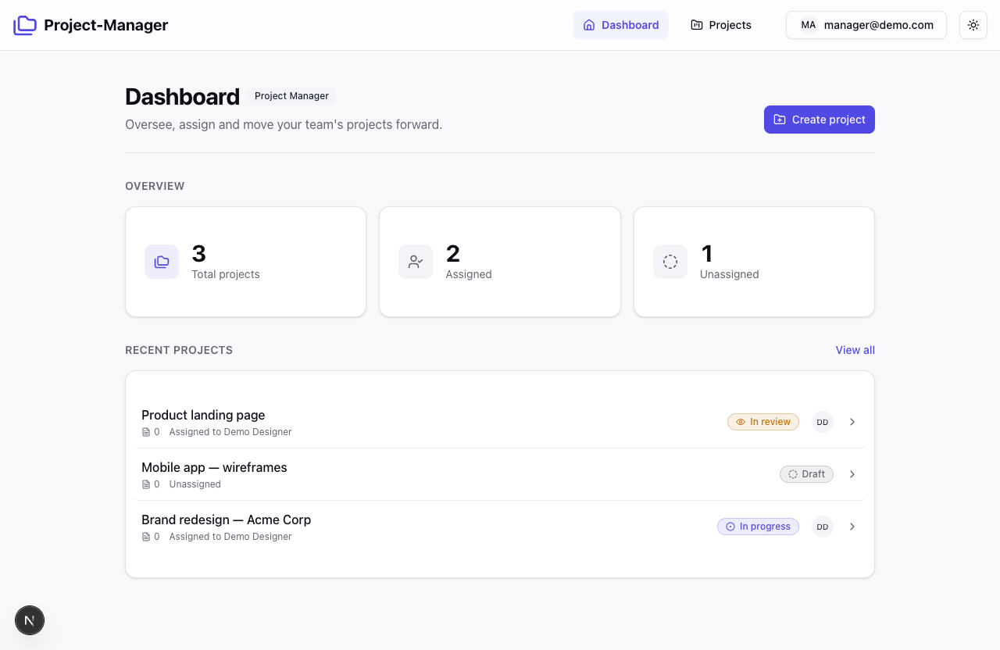
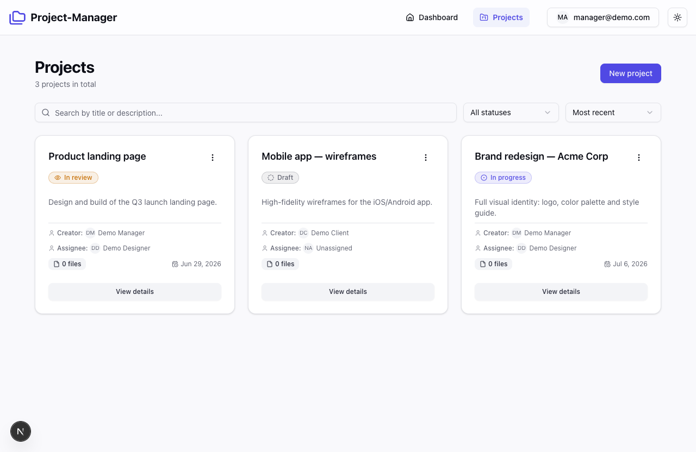

# Project Manager

> A multi-role project management app for design teams — clients brief work, project managers assign it, and designers deliver, all through one role-aware workflow.

<p align="center">
  <a href="https://project-manager-app-cyan.vercel.app"></a>
  
  
  
  
  
</p>

## Live Demo

**[project-manager-app-cyan.vercel.app](https://project-manager-app-cyan.vercel.app)**

Sign in with any of the accounts below to explore the app. Each one lands on a different role-based experience — what you can see, create, assign, and approve changes per role.

| Role | Email | Password |
|------|-------|----------|
| Project Manager | `manager@demo.com` | `demo1234` |
| Client | `client@demo.com` | `demo1234` |
| Designer | `designer@demo.com` | `demo1234` |

## Tech Stack

- **Framework** — [Next.js 16](https://nextjs.org/) (App Router, React Server Components)
- **Language** — TypeScript 5, React 19
- **Styling** — Tailwind CSS v4, [shadcn/ui](https://ui.shadcn.com/) (new-york), Lucide icons
- **ORM** — Prisma 6
- **Backend** — Supabase (Postgres + Auth + Storage)
- **Data fetching** — TanStack React Query 5
- **Forms & validation** — React Hook Form + Zod

## Key Features

- **Role-based access** for three roles — Clients, Project Managers, and Designers — each with a tailored view and permission set. Project Managers see everything; Clients see the projects they created; Designers see only projects assigned to them.
- **Project lifecycle** with a four-stage status (`Draft` → `In progress` → `In review` → `Done`) and optional due dates.
- **Role-aware status workflow** — Designers can move work forward and submit it for review, while only the Project Manager or the owning Client can give final approval and mark a project as `Done`. Enforced server-side, not just in the UI.
- **Search, filter, and sort** on the projects list — search by title or description, filter by status, and sort projects across the workflow.
- **File uploads to Supabase Storage** with drag-and-drop, plus client-side validation of file count, size, and type.
- **Light / dark theme** via `next-themes`, with a no-flash toggle.
- **Responsive design** that holds up from mobile to desktop.

## Architecture Notes

- **Application-level authorization in a service layer.** All access rules live in [`lib/services/project-service.ts`](lib/services/project-service.ts) (`canViewProject`, `canManageProject`, `canUpdateProjectStatus`, `updateProjectStatus`). Permissions are resolved server-side so every API route shares the same source of truth — including the workflow rule that reserves the final `Done` sign-off for managers and clients.
- **Type-safe data with Prisma + Zod.** Prisma models the domain (`User`, `Project`, `File`) end to end, while Zod schemas validate form input via the React Hook Form resolver.
- **Optimistic-friendly data fetching with React Query.** Server state is fetched and mutated through TanStack Query hooks (`app/projects/_hooks/`), keeping caches in sync after create / update / delete and during status changes.
- **Design tokens & theming via CSS variables.** Colors are defined as OKLCH custom properties in `app/globals.css` (including dedicated `--status-*` tokens) and mapped through Tailwind v4's `@theme`, so light/dark and status colors stay consistent across the UI.

## Screenshots

<!-- Screenshots to be added -->





## Getting Started

### Prerequisites

- Node.js 20+
- A [Supabase](https://supabase.com/) project (provides Postgres, Auth, and Storage)

### 1. Install dependencies

```bash
npm install
```

### 2. Configure environment variables

Create a `.env.local` file in the project root:

```bash
# Postgres connection (from your Supabase project settings)
DATABASE_URL=
DIRECT_URL=

# Supabase API
NEXT_PUBLIC_SUPABASE_URL=
NEXT_PUBLIC_SUPABASE_ANON_KEY=
```

In your Supabase project, enable the Email auth provider and create a Storage bucket named `project-files` for uploads.

### 3. Set up the database

```bash
npx prisma generate   # generate the Prisma client
npx prisma db push    # sync the schema to your database
```

### 4. Run the app

```bash
npm run dev
```

Open [http://localhost:3000](http://localhost:3000). For a production build, run `npm run build` followed by `npm run start`.

## Project Structure

```
app/
  api/              # Route handlers (projects, files, status, designers)
  auth/             # Login, register, callback/confirm routes, auth context
  components/       # Feature UI (dashboard, forms, projects, navbar, theme)
  projects/         # Project routes + colocated hooks and utils
  globals.css       # OKLCH design tokens and Tailwind theme
components/ui/      # shadcn/ui primitives
lib/
  services/         # Application/authorization service layer
  supabase/         # Server, client, and middleware Supabase setup
  prisma.ts         # Prisma client singleton
prisma/
  schema.prisma     # User, Project, File models + enums
middleware.ts       # Session refresh / route protection
```
